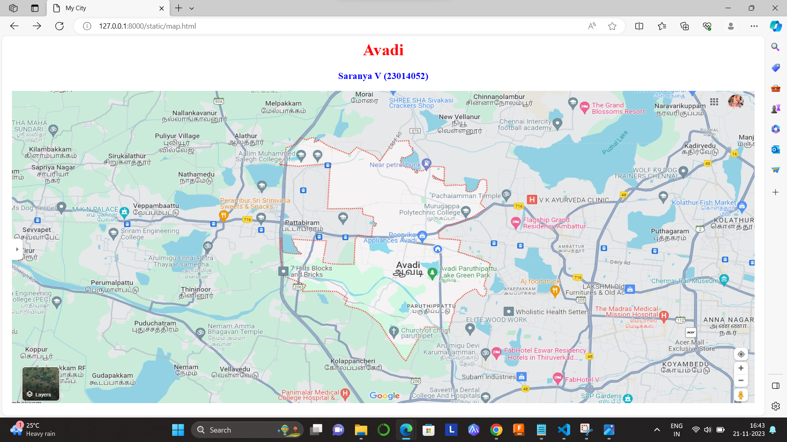
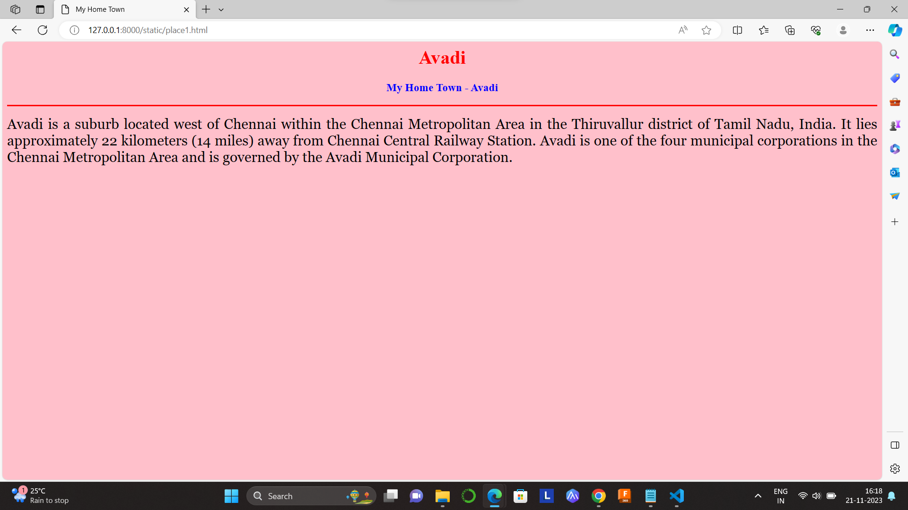
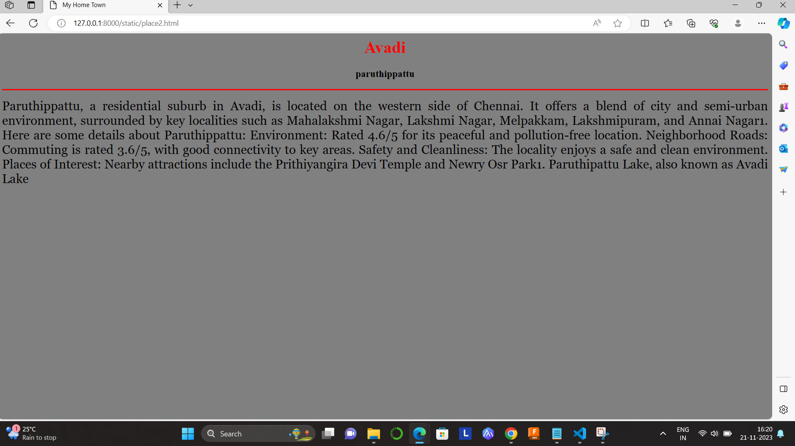
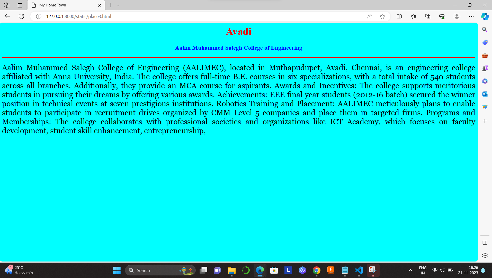
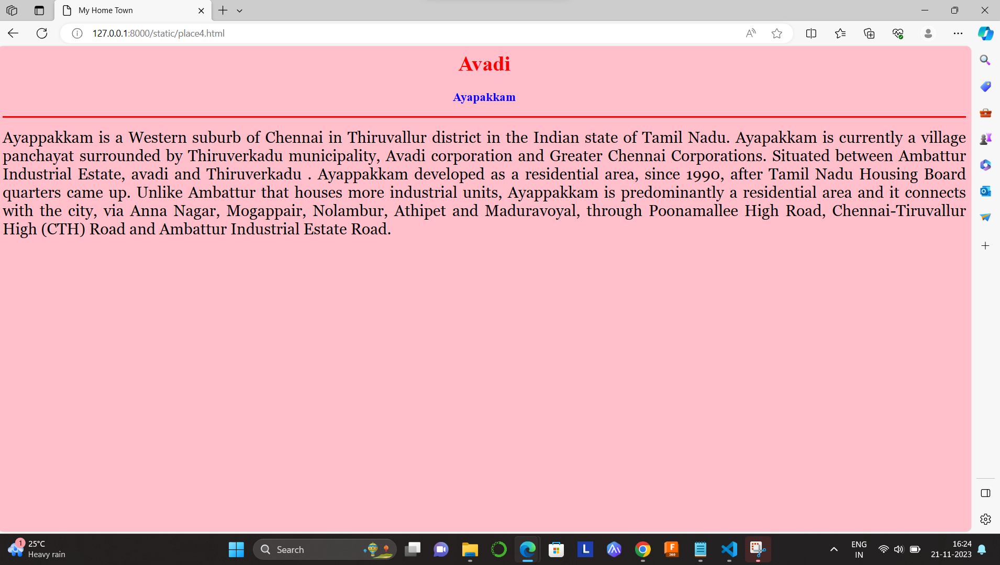
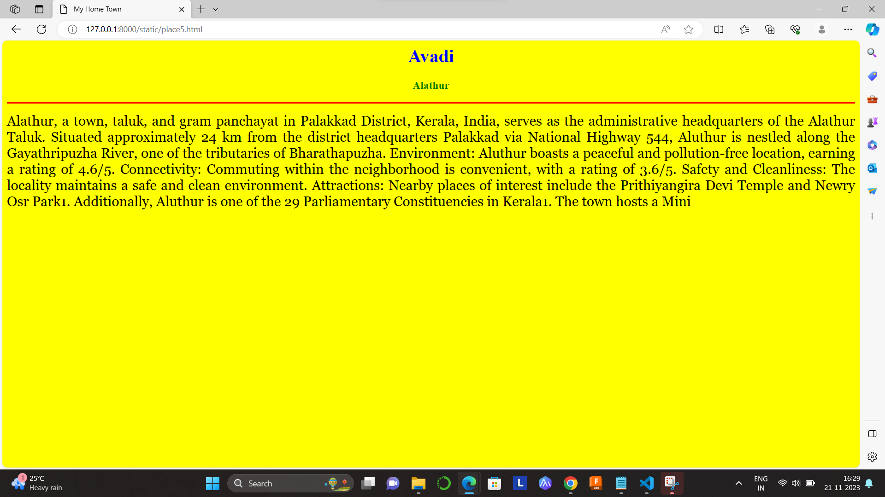

# Ex04 Places Around Me
## Date: 21.11.23

## AIM
To develop a website to display details about the places around my house.

## DESIGN STEPS

### STEP 1
Create a Django admin interface.

### STEP 2
Download your city map from Google.

### STEP 3
Using ```<map>``` tag name the map.

### STEP 4
Create clickable regions in the image using ```<area>``` tag.

### STEP 5
Write HTML programs for all the regions identified.

### STEP 6
Execute the programs and publish them.

## CODE
```
map.html

<html>

<head>

<title>My City</title>

</head>

<body>

<h1 align="center">

<font color="red"><b>Avadi</b></font>

</h1>

<h3 align="center">

<font color="blue"><b>Saranya V (23014052)</b></font>

</h3>

<center>


<map name="MyCity">
    <area shape="rect" coords="700,150,300,500" href="place1.html" title="My Home Town">
    <area shape="rect" coords="1000,350,200,500"  href="place2.html" title="paruthippattu">
    <area shape="rect" coords="520,100,550,200"  href="place3.html" title="Aalim Muhammed salegh college of engineering">
    <area shape="rect" coords="1050,350,200,500"  href="place4.html" title="Ayappakam">
    <area shape="rect" coords="380,100,550,200"  href="place5.html" title="Alathur">
</map>

</center>

</body>

</html>

place1.html

<html>

<head>

<title>My Home Town</title>

</head>

<body bgcolor="pink">

<h1 align="center">

<font color="red"><b>Avadi</b></font>

</h1>

<h3 align="center">

<font color="blue"><b>My Home Town - Avadi</b></font>

</h3>

<hr size="3" color="red">

<p align="justify">

<font face="Georgia" size="5">
 Avadi is a suburb located west of Chennai within the Chennai Metropolitan Area in the Thiruvallur district of Tamil Nadu, India. It lies approximately 22 kilometers (14 miles) away from Chennai Central Railway Station. Avadi is one of the four municipal corporations in the Chennai Metropolitan Area and is governed by the Avadi Municipal Corporation.

</p>

</body>

</html>

place2.html

<html>

<head>

<title>My Home Town</title>

</head>

<body bgcolor="grey">

<h1 align="center">

<font color="red"><b>Avadi</b></font>

</h1>

<h3 align="center">

<font color="black"><b>paruthippattu</b></font>

</h3>

<hr size="3" color="red">

<p align="justify">

<font face="Georgia" size="5">
 Paruthippattu, a residential suburb in Avadi, is located on the western side of Chennai. It offers a blend of city and semi-urban environment, surrounded by key localities such as Mahalakshmi Nagar, Lakshmi Nagar, Melpakkam, Lakshmipuram, and Annai Nagar1. Here are some details about Paruthippattu:
   Environment: Rated 4.6/5 for its peaceful and pollution-free location.
   Neighborhood Roads: Commuting is rated 3.6/5, with good connectivity to key areas.
   Safety and Cleanliness: The locality enjoys a safe and clean environment.
   Places of Interest: Nearby attractions include the Prithiyangira Devi Temple and Newry Osr Park1.
   Paruthipattu Lake, also known as Avadi Lake
</p>

</body>

</html>

place3.html

<html>

<head>

<title>My Home Town</title>

</head>

<body bgcolor="aqua">

<h1 align="center">

<font color="red"><b>Avadi</b></font>

</h1>

<h3 align="center">

<font color="blue"><b>Aalim Muhammed Salegh College of Engineering </b></font>

</h3>

<hr size="3" color="red">

<p align="justify">

<font face="Georgia" size="5">
    Aalim Muhammed Salegh College of Engineering (AALIMEC), located in Muthapudupet, Avadi, Chennai, is an engineering college affiliated with Anna University, India. The college offers full-time B.E. courses in six specializations, with a total intake of 540 students across all branches. Additionally, they provide an MCA course for aspirants.
    Awards and Incentives: The college supports meritorious students in pursuing their dreams by offering various awards.
    Achievements: EEE final year students (2012-16 batch) secured the winner position in technical events at seven prestigious institutions.
    Robotics Training and Placement: AALIMEC meticulously plans to enable students to participate in recruitment drives organized by CMM Level 5 companies and place them in targeted firms.
    Programs and Memberships: The college collaborates with professional societies and organizations like ICT Academy, which focuses on faculty development, student skill enhancement, entrepreneurship,
</p>

</body>

</html>

place4.html

<html>

<head>

<title>My Home Town</title>

</head>

<body bgcolor="pink">

<h1 align="center">

<font color="red"><b>Avadi</b></font>

</h1>

<h3 align="center">

<font color="blue"><b>Ayapakkam</b></font>

</h3>

<hr size="3" color="red">

<p align="justify">

<font face="Georgia" size="5">
    Ayappakkam is a Western suburb of Chennai in Thiruvallur district in the Indian state of Tamil Nadu. Ayapakkam is currently a village panchayat surrounded by Thiruverkadu municipality, Avadi corporation and Greater Chennai Corporations.
    Situated between Ambattur Industrial Estate, avadi and Thiruverkadu . Ayappakkam developed as a residential area, since 1990, after Tamil Nadu Housing Board quarters came up. Unlike Ambattur that houses more industrial units, Ayappakkam is predominantly a residential area and it connects with the city, via Anna Nagar, Mogappair, Nolambur, Athipet and Maduravoyal, through Poonamallee High Road, Chennai-Tiruvallur High (CTH) Road and Ambattur Industrial Estate Road. 
</p>
    
    </body>
    
    </html>
</p>

</body>

</html>

place5.html

<html>

<head>

<title>My Home Town</title>

</head>

<body bgcolor="yellow">

<h1 align="center">

<font color="blue"><b>Avadi</b></font>

</h1>

<h3 align="center">

<font color="green"><b>Alathur</b></font>

</h3>

<hr size="3" color="red">

<p align="justify">

<font face="Georgia" size="5">
    Alathur, a town, taluk, and gram panchayat in Palakkad District, Kerala, India, serves as the administrative headquarters of the Alathur Taluk. Situated approximately 24 km from the district headquarters Palakkad via National Highway 544, Aluthur is nestled along the Gayathripuzha River, one of the tributaries of Bharathapuzha.
    Environment: Aluthur boasts a peaceful and pollution-free location, earning a rating of 4.6/5.
    Connectivity: Commuting within the neighborhood is convenient, with a rating of 3.6/5.
    Safety and Cleanliness: The locality maintains a safe and clean environment.
    Attractions: Nearby places of interest include the Prithiyangira Devi Temple and Newry Osr Park1.
    Additionally, Aluthur is one of the 29 Parliamentary Constituencies in Kerala1. The town hosts a Mini
</p>

</body>

</html>

```

## OUTPUT







## RESULT
___
The program for implementing image maps using HTML is executed successfully.
___
